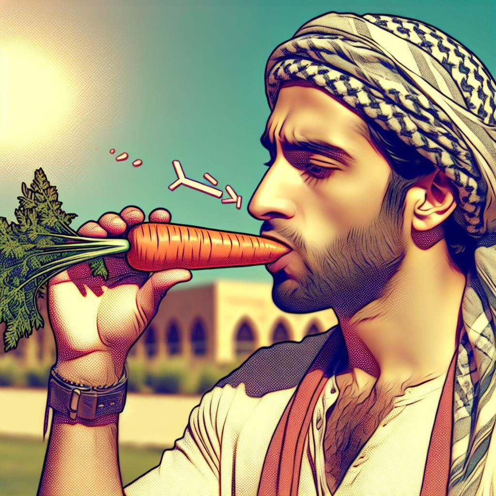

# VLM-Image-Analysis: A Vision-and-Language Modeling Framework

Welcome to the Hugging Face Space (https://huggingface.co/spaces/BoltzmannEntropy/vlms) for VLM-Image-Analysis. This space showcases a cutting-edge framework that combines multiple Vision-Language Models (VLMs) and a Large Language Model (LLM) to provide comprehensive image analysis and captioning.

<h1 align="center">    
  </a>
  <h6> (Source: wang2023allseeing: https://huggingface.co/datasets/OpenGVLab/CRPE?row=1) <h6>  
</h1>

This repository contains the core code for a multi-model framework that enhances image interpretation through the combined power of several Vision-and-Language Modeling (VLM) systems. VLM-Image-Analysis delivers detailed, multi-faceted analyses of images by leveraging N cutting-edge VLM models, pre-trained on a wide range of datasets to detect diverse visual cues and linguistic patterns.

It is available on HF at the follwing HF space: https://huggingface.co/spaces/BoltzmannEntropy/vlms/

<h1 align="center">    
  </a>  
</h1>

1. Multiple VLMs analyze the input image independently, providing diverse perspectives.
2. A 'judge' LLM synthesizes these outputs into a comprehensive, coherent description.


## Abstract


This research introduces a technique in the realm of automatic image captioning that leverages the collaborative potential between Vision-Language Models (VLMs) and Large Language Models (LLMs). Our  method utilizes a two-tiered framework: initially, various VLMs provide diverse verbal descriptions of an image based on unique prompts; subsequently, these array of captions are integrated by a central 'judge' LLM to produce a cohesive and comprehensive caption that encapsulates the essence of the image. The objective of this synergistic approach is to elevate the precision, richness, and contextual appropriateness of image descriptions by pooling together diverse model capabilities. We validate the effectiveness of our dual-model strategy across a spectrum of VLMs—namely Qwen2-VL, Phi-3-vision, and Moondream2—and assess its performance on different datasets. Our empirical results indicate that this ensemble method yields image captions with substantially higher quality and depth than traditional single-model approaches, marking a significant stride in the evolution of computer vision technology.

**Note: The 'judge' LLM to code has not been fully completed yet. **

## Introduction

The field of computer vision has undergone significant transformations in recent times, especially within the niche area of generating descriptive text for images—a task known as image captioning. Vision-Language Models (VLMs) have risen to prominence as instrumental instruments that facilitate the seamless integration of visual information with comprehension of natural language. Despite their capabilities, individual VLMs may possess unique advantages and constraints, which can sometimes result in descriptions that are either biased or lack completeness. This situation thus opens up a scope for creative approaches that can capitalize on the strengths of multiple models to produce more balanced and comprehensive image interpretations.

<h1 align="center">    
  </a>  
</h1>

To address this issue, we introduce a novel methodology that leverages the combined strengths of multiple VLMs in conjunction with a Large Language Model (LLM) acting as a judge. Our approach is designed to produce more comprehensive, accurate, and contextually rich image captions by following a two-stage process:

1. **Multi-VLM Caption Generation**: In the first stage, we employ several distinct VLMs, including Qwen2-VL, Phi-3-vision, and Moondream2, to generate image descriptions. Each model is prompted with different instructions, encouraging diverse perspectives on the image content. This diversity is crucial, as it allows for a more comprehensive capture of the image's nuances and details.

2. **LLM-based Caption Synthesis**: The second stage involves using a 'judge' LLM to analyse and synthesise the outputs from the first stage. This model is tasked with unifying the various descriptions into a single, coherent caption that captures the essence of all initial responses. The judge LLM's role is not merely to aggregate information but to intelligently combine and refine the insights provided by the VLMs.

Our methodology leverages state-of-the-art models and techniques, including:

- The Qwen2-VL family of models, which offer varying capabilities and model sizes, allowing for a range of perspectives and computational efficiencies.
- Microsoft's Phi-3-vision model, known for its efficiency and performance in visual understanding tasks.
- The Moondream2 model, which brings unique perspectives to image understanding, potentially capturing aspects overlooked by other models.

The implementation utilises advanced libraries such as PyTorch and Hugging Face's Transformers, ensuring efficient processing and easy integration with existing deep learning workflows. We have also incorporated features to handle both individual images and batch processing from datasets or ZIP files, making our approach versatile for various research and practical applications.

By combining multiple VLMs and using an LLM as a judge, we aim to mitigate individual model biases, capture a broader range of image details, and produce captions that are more informative and contextually appropriate. This approach not only improves the quality of image captioning but also opens up new avenues for exploring the synergies between different AI models in multimodal tasks.

It is important to note, however, that while our method shows promise, it is not without limitations. The effectiveness of the approach may vary depending on the specific combination of models used and the nature of the images being captioned. Additionally, the computational resources required for this ensemble approach are significantly higher than those needed for single-model methods, which may limit its applicability in resource-constrained environments.

In the following sections, we shall detail our methodology, present the experimental setup, and discuss the results and implications of our findings. We believe this work contributes significantly to the field of image captioning and demonstrates the potential of ensemble approaches in vision-language tasks.


## Table of Contents

- [VLM-Image-Analysis: A Vision-and-Language Modeling Framework](#vlm-image-analysis-a-vision-and-language-modeling-framework)
  - [Abstract](#abstract)
  - [Introduction](#introduction)
  - [Table of Contents](#table-of-contents)
  - [Base VLMs](#base-vlms)
  - [Judge VLM](#judge-vlm)
- [How to Use](#how-to-use)
  - [Example Process](#example-process)
  - [Models](#models)
  - [Setup](#setup)
  - [Inference](#inference)
  - [The Gradio APP](#the-gradio-app)
    - [1. VLM Model Selection](#1-vlm-model-selection)
    - [2. Device Settings](#2-device-settings)
    - [3. Image Selection](#3-image-selection)
  - [Docker Setup for LLMs](#docker-setup-for-llms)
    - [Base System](#base-system)
    - [LLM-related Packages](#llm-related-packages)
    - [Jupyter Configuration](#jupyter-configuration)
    - [Exposed Ports](#exposed-ports)
  - [Prompts](#prompts)
    - [Example of Available Prompts](#example-of-available-prompts)
  - [Citation](#citation)

## Base VLMs

The first phase of the framework isolates each specialized VLM model to individually analyse an input image. Each model processes the image independently, resulting in multiple descriptive outputs from different viewpoints. These models are carefully selected based on their unique strengths in visual and textual analysis, ensuring a comprehensive examination of the image.

For instance, a VLM might be prompted with the following directive:
```
"Provide an extensive description of all elements in this image, including objects, people, and activities."
```

This phase enables the generation of varied textual descriptions and captions, offering diverse perspectives on the visual content.

## Judge VLM

In the second phase, the outputs from the base VLMs are passed to a synthesizing "Judge" VLM model. This model is specifically trained to merge the individual outputs into a coherent, unified conclusion that captures the overall context of the image.

The Judge VLM is designed to handle different types of input data, including textual descriptions from both K and V models. Its role is to harmonise and integrate these multiple viewpoints, providing a more comprehensive synthesis of the image's content.

# How to Use

1. **Access the Space**: Click on the "Open in Spaces" badge at the top of this README or visit [https://huggingface.co/spaces/BoltzmannEntropy/vlms](https://huggingface.co/spaces/BoltzmannEntropy/vlms)

2. **Select a Dataset**: Choose from the available Hugging Face datasets:
   - gokaygokay/panorama_hdr_dataset
   - OpenGVLab/CRPE

3. **Select Models**: Choose which VLMs you want to use for the analysis from the available options.

4. **Choose Prompts**: Select from predefined prompts or enter a custom prompt to guide the analysis.

5. **Run Analysis**: Click the "Submit" button to start the image analysis process.

6. **View Results**: The generated descriptions, detected text, and translations will be displayed in the interface.

## Example Process

For instance, when the system processes an image and generates an initial textual output from a model such as "microsoft/Phi-3-vision-128k-instruct," the Judge VLM then engages the "Qwen/Qwen2-VL-7B-Instruct" model for further analysis. The Qwen/Qwen2 model evaluates this initial interpretation and offers a synthesized response that integrates both visual and textual insights, providing a final, nuanced interpretation to the user or downstream system.

## Models

The framework utilises multiple advanced Vision-and-Language Models (VLMs). For more details, refer to the respective model documentation:
- [Microsoft/Phi-3-Vision-128K-Instruct](https://huggingface.co/microsoft/Phi-3-Vision-128K-Instruct)
- [Qwen/Qwen2-VL-7B-Instruct](https://huggingface.co/Qwen/Qwen2-VL-7B-Instruct)

## Setup

To set up this project, follow these steps in a terminal:

1. **Clone the Repository**

    - Clone the repository to your local machine:
      ```bash
      git clone https://github.com/your-repo/vlm-image-analysis.git
      cd vlm-image-analysis
      ```

2. **Run the docker:**
   

After completing these steps, your setup should be complete and you can start using the project.

## Inference

Start the docker container: 
```bash
docker run --gpus all --rm -it --shm-size=8gb --memory="16g" --env="DISPLAY" -p 8077:7842 -p 7860:7860  -p 8501:8501 -v %cd%:/RAG -v %cd%:/root/sharedfolder -v %cd%/.cache:/root/.cache  lmdeploy-docker:latest bash
```

You should see something like:
```
==========
== CUDA ==
==========

CUDA Version 12.1.1

Container image Copyright (c) 2016-2023, NVIDIA CORPORATION & AFFILIATES. All rights reserved.

This container image and its contents are governed by the NVIDIA Deep Learning Container License.
By pulling and using the container, you accept the terms and conditions of this license:
https://developer.nvidia.com/ngc/nvidia-deep-learning-container-license

A copy of this license is made available in this container at /NGC-DL-CONTAINER-LICENSE for your convenience.

root@c6d710b08cde:/RAG/web#
```

To run the application:

```bash
root@c6d710b08cde:/RAG/web# python vlms.py
```

Which should output:
```bash
Running on local URL:  http://0.0.0.0:7860
To create a public link, set `share=True` in `launch()`.
```

On initial use, the models are very slowly downloaded to a folder which is mapped externally using the docker -v command:
```
-v %cd%/.cache:/root/.cache
 ```

For instance:
```
root@c6d710b08cde:/RAG/web# ls -ls /root/.cache/huggingface/
0 drwxr-xr-x 1 root root 512 Sep 12 06:15 models--OpenGVLab--InternVL2-1B
0 drwxr-xr-x 1 root root 512 Sep 12 06:27 models--Qwen--Qwen2-VL-7B-Instruct
0 drwxr-xr-x 1 root root 512 Sep 16 11:14 models--Qwen--Qwen2-VL-7B-Instruct-GPTQ-Int8
0 drwxr-xr-x 1 root root 512 Sep 11 11:00 models--microsoft--Phi-3-vision-128k-instruct
0 drwxr-xr-x 1 root root 512 Sep 15 06:02 models--vikhyatk--moondream2
```

## The Gradio APP

The Gradio application provides a user-friendly interface for interacting with the VLM-Image-Analysis framework. It includes three main tabs: **VLM Model Selection**, **Device Settings**, and **Image Selection**. Each tab allows users to configure different aspects of the image analysis process.

### 1. VLM Model Selection

This tab allows users to select the Vision-and-Language Models (VLMs) they want to use, specify the directory of images to be analyzed, and choose prompts for generating textual descriptions. The interface includes:

- **Model Selection**: A checkbox group where users can select from available models such as `Qwen/Qwen2-VL-7B-Instruct`, `microsoft/Phi-3-vision-128k-instruct`, `vikhyatk/moondream2`, and `Qwen/Qwen2-VL-7B-Instruct-GPTQ-Int8`.
- **Image Directory Path**: A textbox to input the path to the directory containing images.
- **Prompt Selection**: A checkbox group where users can select from predefined prompts that guide the analysis.
- **Submit Button**: A button to run the inference based on the selected models, prompts, and image directory.

The results of the inference are displayed in an HTML format, showing the generated descriptions, detected text, and translations.

### 2. Device Settings

<h1 align="center">    
  </a>  
</h1>

In this tab, users can configure settings related to the computational resources used for running the models:

- **Device Map**: A radio button selection to choose the device map (`auto`, `cpu`, `cuda`). This determines whether the inference will use the GPU or CPU.
- **Torch Dtype**: A radio button to select the data type for PyTorch (`torch.float16` or `torch.float32`). This affects the precision and performance of the model.
- **Trust Remote Code**: A checkbox to indicate whether to trust remote code when loading models. This is relevant for models that require remote execution code.

### 3. Image Selection

This tab allows users to process images from the specified HF Dataset:
```
# List of available Hugging Face datasets
dataset_options = [
    "gokaygokay/panorama_hdr_dataset",  
    "OpenGVLab/CRPE"  
]
```

- **HF Image Dataset**: A textbox to input the path to the HF dataset containing images.
- **Load a ZIP of Images Button**: A button to load and images from the specified ZIP file.

## Docker Setup for LLMs

### Base System

The Docker image is based on the `pytorch/pytorch:2.2.2-cuda12.1-cudnn8-devel` image, which provides a PyTorch environment with CUDA 12.1 and cuDNN 8 for GPU acceleration. 

### LLM-related Packages

- **MLC LLM**: Installed from a nightly build URL, including `mlc-llm-nightly-cu122` for LLM services.
- **AutoAWQ**: Cloned from GitHub and installed, which likely includes functionality for automatic quantization and weight compression.
- **FlashAttention**: The package `flash-attn==2.6.1` is installed to optimize attention mechanisms in transformer models.
- **Transformers**: The `transformers==4.33.0` package is used for working with pre-trained transformer models, along with `accelerate`, `diffusers`, `datasets`, `timm` for various model and dataset utilities.
- **Other Libraries**: `chromadb`, `db-sqlite3`, `auto-gptq`, `exllama`, `sqlalchemy`, `optimum`, and `autoawq` for additional functionalities related to data handling, model optimization, and automatic weight quantization.

### Jupyter Configuration

- **Jupyter**: Jupyter Notebook and related packages are set up, including configuration through `jupyter_notebook_config.py` and a script `run_jupyter.sh`.

### Exposed Ports

The container exposes the following ports for accessing services:
- `8097`, `7842`, `8501`, `8000`, `6666`, `7860`


## Prompts

The framework uses a variety of prompts to guide the Vision-and-Language Modeling (VLM) systems in generating descriptive outputs from images. Each prompt is designed to elicit detailed and specific information from the models.

### Example of Available Prompts

1. **Comprehensive Image Analysis**
   - **Prompt**: 
     ```
     Thoroughly analyse the provided image and generate a comprehensive description of its content. This includes identifying and describing all objects, people, and activities visible in the image. Additionally, detect and extract any text present within the image using Optical Character Recognition (OCR), regardless of the language. Present the extracted text in a structured table format, including columns for the original text, its translation into English, and the language of the text.
     ```
   - **Rationale**: This prompt is designed to provide an exhaustive analysis of the image, encompassing both visual and textual information. It aims to capture every detail, making it suitable for applications where a complete understanding of the image is necessary, such as in detailed reporting or comprehensive data annotation.


## Citation

Please consider citing the work if you consider it useful for your research:

```
@book{judge-vlm,
  author       = {Shlomo Kashani},
  title        = {VLM-Image-Analysis: A Vision-and-Language Modeling Framework},
  year         = {2024},  
  github       = {https://huggingface.co/spaces/BoltzmannEntropy/vlms/}
}
```